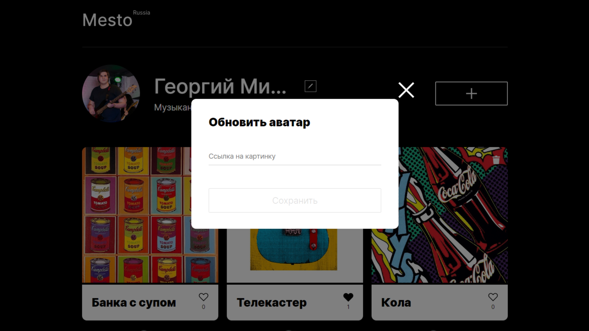
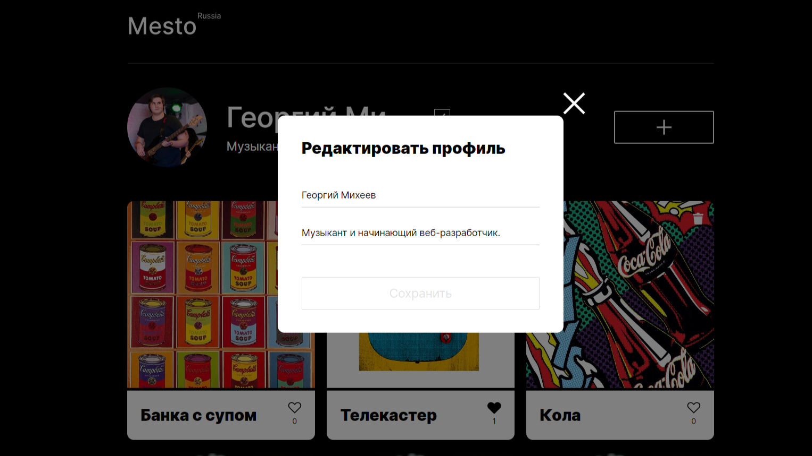

# Проектная работа Mesto

## Кратко о проекте.

Данная работа выполнялась в рамках обучения в "Яндекс Практикум".
Этот проект представляет собой небольшой одностраничный сайт, который дает возможность:

* *Делиться карточками с картинками;*
* *Просматривать картинки других пользователей;*
* *Удалять ранее добавленные вами карточки;*
* *Редактировать ник и информация о пользователе;*
* *Менять аватар пользователя;*
* *Ставить лайки карточкам.*

**Ознакомиться с проектом Mesto можно по ***[ссылке](https://georgemikheev.github.io/mesto-project-ff/).*****

___

## Инструкция.

### Изменение аватара пользователя:

Для того, что бы поменять автар - нужно кликнуть по нему левой кнопкой  мыши. После чего откроется модальное окно, куда нужно будет ввести ссылку на фотографию или картинку, которую вы ходите загрузить и нажать кнопку "Сохранить".

___

### Изменение данных пользователя:

Для изменения данных пользователя вам необходимо кликнуть по иконке рядом с именем. После этого откроется модальное окно. В нем вам будет предложено поменять имя пользователя или информацию о себе. После того как вы внесете все необходимые изменения - нужно нажать на кнопку "Сохранить" и новые данные сразу отобразяться на странице.

___

### Добавление новой карточки:

Для того, что бы добавить на страницу новую карточку с картинкой нужно нажать на кнопку "+". В открывшемся модальном окне необходимо ввести заголовок карточки и ссылку на картинку, которую вы хотели бы разместить. Когда все будет готово нужно нажать на кнопку "Сохранить", после чего новая карточка сразу же будет добавлена на страницу.

___

### Удаления карточек:

Что бы удалить карточку нужно нажать на кнопку "удаление карточки", которая находится в верхнем, правом углу картинки.
Перед удалением откроется модальное окно, которое попросит подтвертить улаоение, при нажатии на кнопку "Да" карточка безвозратно удалиться с сервера и со страницы. Что бы карточка не удалилась нужно просто закрыть модьльное окно.

**Важно:** удалять можно только свои карточки.

___

### Закрытие модьльных окон.

Есть три способа закрыть любое модальное окно на этой странице:
  
  * Нажать на крестик;
  * кликнуть левой кнопкой мыши по любому месту на странице за пределами модального океана;
  * Нажать клавишу "Esc".
  
___

## Технологии.

**В данном проекте были использованы следующие технологии:**

:white_check_mark: HTML;

:white_check_mark: CSS;

:white_check_mark: webpack;

:white_check_mark: Java Script;

:white_check_mark: API.
